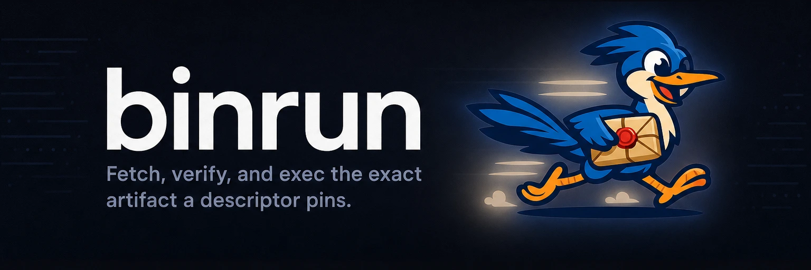

# 

**TODO(bootstrap): opener fragment, 80 chars max, in the writing-docs opener
register.** TODO(bootstrap): at most one plain expansion sentence — see the
writing-docs skill's `references/readme.md` for the register and the skeleton.

[](https://github.com/yasyf/binrun/releases)
[](https://github.com/yasyf/binrun/actions/workflows/ci.yml)
[](https://github.com/yasyf/binrun/blob/main/LICENSE)

## Get started

```bash
brew install yasyf/tap/binrun
binrun hello
```

<details>
<summary>Without Homebrew</summary>

```bash
go install github.com/yasyf/binrun/cmd/binrun@latest
```

</details>


TODO(bootstrap): replace `hello` above with the real first command, then capture
the demo as a real run of that exact command. Default: a static terminal
screenshot via freeze, with the one-liner committed at `docs/scripts/demo.sh`.
When motion is the payoff (TUI, progress, multi-step flow): an animated SVG via
the cli-demo skill, with `.cli-demo/demo.tape` committed. No tooling: replace the
img line with a fenced output block.

Driving with an agent? Paste this:

```text
Install binrun (`brew install yasyf/tap/binrun`) and TODO(bootstrap): the first concrete goal to hand an agent.
```

---

## Use cases

TODO(bootstrap): 2-4 `###` subsections, each named for a reader goal, shaped
before/after: one pain sentence, the exact command (or in-app flow), the real
outcome (output, demo image, or metric).

TODO(bootstrap): no docs site — carry the how-to and reference content inline
here, per the writing-docs skill's `references/standalone-readme.md` (no hard
length ceiling; `<details>` blocks and a visual break every 500-1000 words).

TODO(bootstrap): optional one-line `Status:` note (honest maturity), or delete this line.

Licensed under [PolyForm-Noncommercial-1.0.0](LICENSE).
